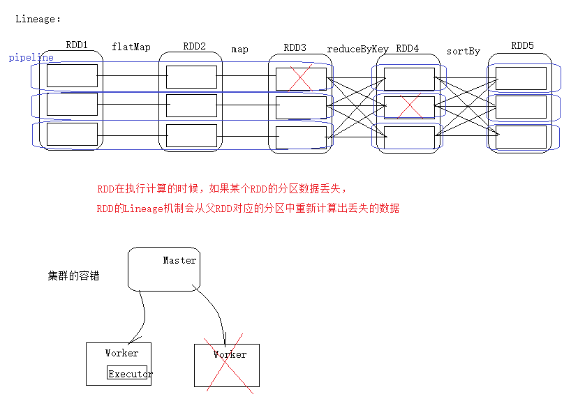
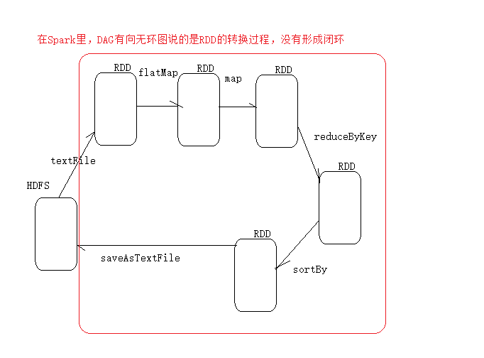
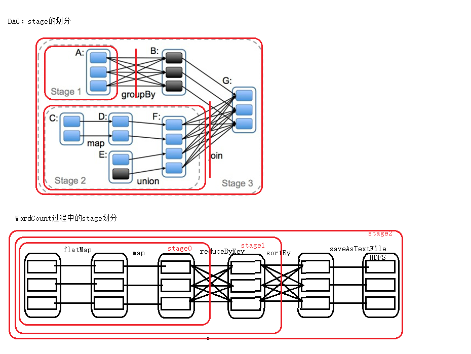
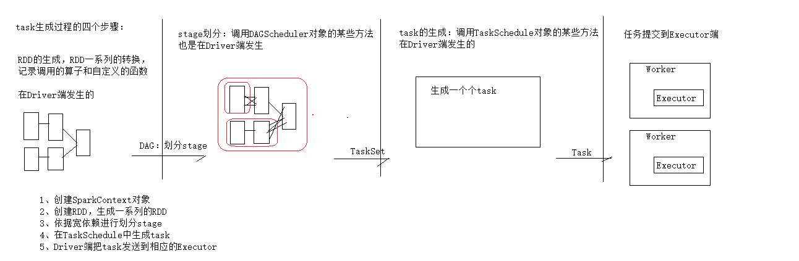

#### lineage，缓存的存储级别，DAG，task生成过程的四个步骤，checkpoint

1. ##### lineage机制

   ##### 

2. ##### 缓存的存储级别

   ##### 

3. ##### DAG

   DAG：是一个无回路的有向图(RDD的转换过程中没有形成闭环)
   RDD通过一系列的转换就形成了DAG，根据不同的依赖关系来划分stage，目的就是为了生成task，划分依据就是判断依赖是否是宽依赖(是否shuffle)

   

4. ##### WordCount过程中的stage划分

   ##### 

5. ##### task生成过程的四个步骤

   1.(在Driver端发生)RDD的生成，RDD一系列的转换，记录调用的算子和自定义的函数
   2.DAG：划分stage(RDD的范围)
     stage划分：调用DAGScheduler对象的某些方法，也是在Driver端发生的
   3.task的生成：调用TaskSchedule对象的某些方法，也是在Driver端发生
   4.任务提交到Executor端(提交task)  (发生在Worker端)

   总结：
   1.创建SparkContext对象
   2.创建RDD，生成一系列RDD
   3.依据宽依赖进行划分stage
   4.在TaskSchedule中生成task
   5.Driver端把task发送发哦相应的Executor

   ​	

   生成task的数量与stage和pipeline是有直接的关系的
   在任务执行过程中如果发生了shuffle，就会有shuffle write和shuffle read
   shuffle write:发生在shuffle之前，把要shuffle的数据先写到磁盘，这样保证了数据的安全性
   shuffle reader:发生在shuffle之后，子RDD读取到父RDD存储的数据

   为什么在发生shuffle的时候，需要保存数据到磁盘？
   1.为了避免占用内存太大而可能内存溢出
   2.保存到磁盘保证了数据的安全性

   

6. ##### checkpoint(检查点)

   在发生shuffle后，往往中间结果数据很重要，如果丢失的话，需要再次进行计算，这会消耗相当多的物理资源和时间
   为了保证数据的安全性，需要做checkpoint。

   注意：
   1.最好把数据checkpoint到HDFS,便于集群的所有节点都能获取到，而且HDFS的多副本机制也保证了数据的安全性
   2.在checkpoint之前最好先cache一下,这样便于运行任务的时候快速的调用，也便于在checkpoint的时候直接从内存获取数据，提高获取数据的速度

   操作步骤：（此处有scala代码）
   1.设置Checepoint的目录
     sc.setCheckpointDir("hdfs://min1:9000/out")
   2.把shuffle后的数据进行缓存
     val cached=rdd1.cache()
   3.把缓存的数据做checkpoint
     cached.checkpoint
   4.查看是否做了检查点：
     rdd1.isCheckpointed
     查看Checkpoint的文件目录信息：
     rdd1.getCheckpointFile