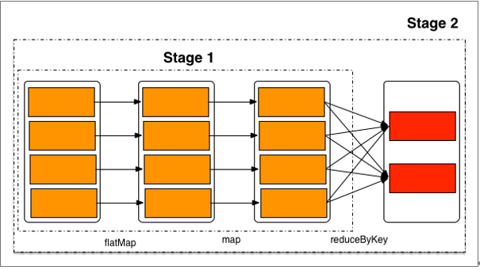

# Spark计算模型

# [1.    课程目标]()

## 1.1.   熟练使用RDD的算子完成计算

## 1.2.   掌握RDD的原理

# 2.     弹性分布式数据集RDD

## 2.1.   RDD概述

### 2.1.1.    什么是RDD

RDD（Resilient Distributed Dataset）叫做分布式数据集，是Spark中最基本的数据抽象，它代表一个不可变、可分区、里面的元素可并行计算的集合。RDD具有数据流模型的特点：自动容错、位置感知性调度和可伸缩性。RDD允许用户在执行多个查询时显式地将工作集缓存在内存中，后续的查询能够重用工作集，这极大地提升了查询速度。

### 2.1.2.    RDD的属性

​                              

1）一组分片（Partition），即数据集的基本组成单位。对于RDD来说，每个分片都会被一个计算任务处理，并决定并行计算的粒度。用户可以在创建RDD时指定RDD的分片个数，如果没有指定，那么就会采用默认值。默认值就是程序所分配到的CPUCore的数目。

 

2）一个计算每个分区的函数。Spark中RDD的计算是以分片为单位的，每个RDD都会实现compute函数以达到这个目的。compute函数会对迭代器进行复合，不需要保存每次计算的结果。

 

3）RDD之间的依赖关系。RDD的每次转换都会生成一个新的RDD，所以RDD之间就会形成类似于流水线一样的前后依赖关系。在部分分区数据丢失时，Spark可以通过这个依赖关系重新计算丢失的分区数据，而不是对RDD的所有分区进行重新计算。

 

4）一个Partitioner，即RDD的分片函数。当前Spark中实现了两种类型的分片函数，一个是基于哈希的HashPartitioner，另外一个是基于范围的RangePartitioner。只有对于key-value的RDD，才会有Partitioner，非key-value的RDD的Parititioner的值是None。Partitioner函数不但决定了RDD本身的分片数量，也决定了parent RDD Shuffle输出时的分片数量。

 

5）一个列表，存储存取每个Partition的优先位置（preferred location）。对于一个HDFS文件来说，这个列表保存的就是每个Partition所在的块的位置。按照“移动数据不如移动计算”的理念，Spark在进行任务调度的时候，会尽可能地将计算任务分配到其所要处理数据块的存储位置。

## 2.2.   创建RDD

1）由一个已经存在的Scala集合创建。

val rdd1 =sc.parallelize(Array(1,2,3,4,5,6,7,8))

** **

2）由外部存储系统的数据集创建，包括本地的文件系统，还有所有Hadoop支持的数据集，比如HDFS、Cassandra、HBase等

val rdd2 =sc.textFile("hdfs://node01/words.txt")

## 2.3.   RDD编程API

### 2.3.1.    Transformation

RDD中的所有转换都是延迟加载的，也就是说，它们并不会直接计算结果。相反的，它们只是记住这些应用到基础数据集（例如一个文件）上的转换动作。只有当发生一个要求返回结果给Driver的动作时，这些转换才会真正运行。这种设计让Spark更加有效率地运行。

 

常用的Transformation：

| **转换**                                                     | **含义**                                                     |
| ------------------------------------------------------------ | ------------------------------------------------------------ |
| **map**(func)****                                            | 返回一个新的RDD，该RDD由每一个输入元素经过func函数转换后组成 |
| **filter**(func)****                                         | 返回一个新的RDD，该RDD由经过func函数计算后返回值为true的输入元素组成 |
| **flatMap**(func)****                                        | 类似于map，但是每一个输入元素可以被映射为0或多个输出元素（所以func应该返回一个序列，而不是单一元素） |
| **mapPartitions**(func)****                                  | 类似于map，但独立地在RDD的每一个分片上运行，因此在类型为T的RDD上运行时，func的函数类型必须是Iterator[T] => Iterator[U] |
| **mapPartitionsWithIndex**(func)****                         | 类似于mapPartitions，但func带有一个整数参数表示分片的索引值，因此在类型为T的RDD上运行时，func的函数类型必须是  (Int, Iterator[T]) => Iterator[U] |
| **sample**(withReplacement,  fraction, seed)****             | 根据fraction指定的比例对数据进行采样，可以选择是否使用随机数进行替换，seed用于指定随机数生成器种子 |
| **union**(otherDataset)****                                  | 对源RDD和参数RDD求并集后返回一个新的RDD                      |
| **intersection**(otherDataset)****                           | 对源RDD和参数RDD求交集后返回一个新的RDD                      |
| **distinct**([numTasks]))****                                | 对源RDD进行去重后返回一个新的RDD                             |
| **groupByKey**([numTasks])** **                              | 在一个(K,V)的RDD上调用，返回一个(K, Iterator[V])的RDD        |
| **reduceByKey**(func, [numTasks])****                        | 在一个(K,V)的RDD上调用，返回一个(K,V)的RDD，使用指定的reduce函数，将相同key的值聚合到一起，与groupByKey类似，reduce任务的个数可以通过第二个可选的参数来设置 |
| **aggregateByKey**(zeroValue)(seqOp,  combOp, [numTasks])**** |                                                              |
| **sortByKey**([ascending],  [numTasks])****                  | 在一个(K,V)的RDD上调用，K必须实现Ordered接口，返回一个按照key进行排序的(K,V)的RDD |
| **sortBy**(func,[ascending],  [numTasks])****                | 与sortByKey类似，但是更灵活                                  |
| **join**(otherDataset,  [numTasks])****                      | 在类型为(K,V)和(K,W)的RDD上调用，返回一个相同key对应的所有元素对在一起的(K,(V,W))的RDD |
| **cogroup**(otherDataset,  [numTasks])****                   | 在类型为(K,V)和(K,W)的RDD上调用，返回一个(K,(Iterable<V>,Iterable<W>))类型的RDD |
| **cartesian**(otherDataset)****                              | 笛卡尔积                                                     |
| **pipe**(command,  [envVars])****                            |                                                              |
| **coalesce**(numPartitions**) **                             |                                                              |
| **repartition**(numPartitions)****                           |                                                              |
| **repartitionAndSortWithinPartitions**(partitioner)****      |                                                              |

### 2.3.2.    Action

| **动作**                                              | **含义**                                                     |
| ----------------------------------------------------- | ------------------------------------------------------------ |
| **reduce**(*func*)                                    | 通过func函数聚集RDD中的所有元素，这个功能必须是可交换且可并联的 |
| **collect**()                                         | 在驱动程序中，以数组的形式返回数据集的所有元素               |
| **count**()                                           | 返回RDD的元素个数                                            |
| **first**()****                                       | 返回RDD的第一个元素（类似于take(1)）                         |
| **take**(*n*)****                                     | 返回一个由数据集的前n个元素组成的数组                        |
| **takeSample**(*withReplacement*,*num*, [*seed*])**** | 返回一个数组，该数组由从数据集中随机采样的num个元素组成，可以选择是否用随机数替换不足的部分，seed用于指定随机数生成器种子 |
| **takeOrdered**(*n*, *[ordering]*)****                | takeOrdered和top类似，只不过以和top相反的顺序返回元素        |
| **saveAsTextFile**(*path*)****                        | 将数据集的元素以textfile的形式保存到HDFS文件系统或者其他支持的文件系统，对于每个元素，Spark将会调用toString方法，将它装换为文件中的文本 |
| **saveAsSequenceFile**(*path*) ****                   | 将数据集中的元素以Hadoop sequencefile的格式保存到指定的目录下，可以使HDFS或者其他Hadoop支持的文件系统。 |
| **saveAsObjectFile**(*path*) ****                     |                                                              |
| **countByKey**()****                                  | 针对(K,V)类型的RDD，返回一个(K,Int)的map，表示每一个key对应的元素个数。 |
| **foreach**(*func*)****                               | 在数据集的每一个元素上，运行函数func进行更新。               |

### 2.3.3.    WordCount中的RDD

 

### 2.3.4.    练习

启动spark-shell

/usr/local/spark-1.5.2-bin-hadoop2.6/bin/spark-shell--master spark://node01:7077 

 

练习1：

//通过并行化生成rdd

val rdd1 = sc.parallelize(List(5, 6, 4, 7, 3, 8, 2,9, 1, 10))

//对rdd1里的每一个元素乘2然后排序

val rdd2 = rdd1.map(_ * 2).sortBy(x => x, true)

//过滤出大于等于十的元素

val rdd3 = rdd2.filter(_ >= 10)

//将元素以数组的方式在客户端显示

rdd3.collect

 

练习2：

val rdd1 = sc.parallelize(Array("a b c","d e f", "h i j"))

//将rdd1里面的每一个元素先切分在压平

val rdd2 = rdd1.flatMap(_.split(' '))

rdd2.collect

//来个复杂的：

val rdd1 = sc.parallelize(List(List("a bc", "a b b"), List("e f g", "a f g"),List("h i j", "a a b")))

//将rdd1里面的每一个元素先切分并压平

val rdd2 = rdd1.flatMap(_.flatMap(_.split("")))

rdd2.collect

 

练习3：

val rdd1 = sc.parallelize(List(5, 6, 4, 3))

val rdd2 = sc.parallelize(List(1, 2, 3, 4))

//求并集

val rdd3 = rdd1.union(rdd2)

 

//求交集

val rdd4 = rdd1.intersection(rdd2)

//去重

rdd3.distinct.collect

rdd4.collect

 

练习4：

val rdd1 = sc.parallelize(List(("tom", 1),("jerry", 3), ("kitty", 2)))

val rdd2 = sc.parallelize(List(("jerry",2), ("tom", 1), ("shuke", 2)))

//求join

val rdd3 = rdd1.join(rdd2)

rdd3.collect

//求左连接和右连接

val rdd3 = rdd1.leftOuterJoin(rdd2)

rdd3.collect

val rdd3 = rdd1.rightOuterJoin(rdd2)

rdd3.collect

//求并集

val rdd4 = rdd1 union rdd2

//按key进行分组

rdd4.groupByKey

rdd4.collect

//分别用groupByKey和reduceByKey实现单词计数

val rdd3 = rdd1 union rdd2

rdd3.groupByKey().mapValues(_.sum).collect

rdd3.reduceByKey(_+_).collect

//groupByKey与reduceByKey的区别

 

练习5：

val rdd1 = sc.parallelize(List(("tom", 1),("tom", 2), ("jerry", 3), ("kitty", 2)))

val rdd2 = sc.parallelize(List(("jerry",2), ("tom", 1), ("shuke", 2)))

//cogroup

val rdd3 = rdd1.cogroup(rdd2)

//注意cogroup与groupByKey的区别

rdd3.collect

 

练习6：

val rdd1 = sc.parallelize(List(1, 2, 3, 4, 5))

//reduce聚合

val rdd2 = rdd1.reduce(_ + _)

 

练习7：

val rdd1 = sc.parallelize(List(("tom", 1),("jerry", 3), ("kitty", 2), ("shuke", 1)))

val rdd2 = sc.parallelize(List(("jerry",2), ("tom", 3), ("shuke", 2), ("kitty", 5)))

val rdd3 = rdd1.union(rdd2)

//按key进行聚合

val rdd4 = rdd3.reduceByKey(_ + _)

rdd4.collect

//按value的降序排序

val rdd5 = rdd4.map(t => (t._2,t._1)).sortByKey(false).map(t => (t._2, t._1))

rdd5.collect

//笛卡尔积

val rdd3 = rdd1.cartesian(rdd2)

//其他：count、top、take、first、takeOrdered

//想要了解更多，访问下面的地址

<http://homepage.cs.latrobe.edu.au/zhe/ZhenHeSparkRDDAPIExamples.html>

## 2.4.   RDD的依赖关系

RDD和它依赖的父RDD（s）的关系有两种不同的类型，即窄依赖（narrow dependency）和宽依赖（wide dependency）。

 

### 2.4.1.    窄依赖

窄依赖指的是每一个父RDD的Partition最多被子RDD的一个Partition使用

总结：窄依赖我们形象的比喻为**独生子女**

### 2.4.2.    宽依赖

宽依赖指的是多个子RDD的Partition会依赖同一个父RDD的Partition

总结：宽依赖我们形象的比喻为**超生**

### 2.4.3.    Lineage

RDD只支持粗粒度转换，即在大量记录上执行的单个操作。将创建RDD的一系列Lineage（即血统）记录下来，以便恢复丢失的分区。RDD的Lineage会记录RDD的元数据信息和转换行为，当该RDD的部分分区数据丢失时，它可以根据这些信息来重新运算和恢复丢失的数据分区。

****

## 2.5.   RDD的缓存

Spark速度非常快的原因之一，就是在不同操作中可以在内存中持久化或缓存多个数据集。当持久化某个RDD后，每一个节点都将把计算的分片结果保存在内存中，并在对此RDD或衍生出的RDD进行的其他动作中重用。这使得后续的动作变得更加迅速。RDD相关的持久化和缓存，是Spark最重要的特征之一。可以说，缓存是Spark构建迭代式算法和快速交互式查询的关键。

### 2.5.1.    RDD缓存方式

RDD通过persist方法或cache方法可以将前面的计算结果缓存，但是并不是这两个方法被调用时立即缓存，而是触发后面的action时，该RDD将会被缓存在计算节点的内存中，并供后面重用。

 

通过查看源码发现cache最终也是调用了persist方法，默认的存储级别都是仅在内存存储一份，Spark的存储级别还有好多种，存储级别在object StorageLevel中定义的。

 

缓存有可能丢失，或者存储于内存的数据由于内存不足而被删除，RDD的缓存容错机制保证了即使缓存丢失也能保证计算的正确执行。通过基于RDD的一系列转换，丢失的数据会被重算，由于RDD的各个Partition是相对独立的，因此只需要计算丢失的部分即可，并不需要重算全部Partition。

 

## 2.6.   DAG的生成

DAG(Directed AcyclicGraph)叫做有向无环图，原始的RDD通过一系列的转换就就形成了DAG，根据RDD之间的依赖关系的不同将DAG划分成不同的Stage，对于窄依赖，partition的转换处理在Stage中完成计算。对于宽依赖，由于有Shuffle的存在，只能在parent RDD处理完成后，才能开始接下来的计算，因此宽依赖是划分Stage的依据。

 

 