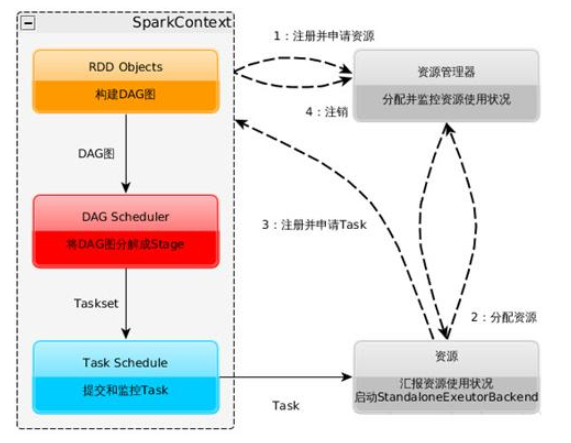

### Spark运行基本流程

1.构建Spark Application的运行环境(启动SparkContext)，SparkContext向资源管理器（可以是Standalone、Mesos、Yarn）注册并申请运行Executor资源；

2.资源管理器分配Executor资源并启动StandaloneExecutorBackend,Executor运行情况将随着心跳发送发哦资源管理器上；

3.SparkContext构建成DAG图，将DAG图分解成Stage，并将Taskset发送到Task Scheduler。Executor向SparkContext申请Task,Task Scheduler将Task发送给Executor运行同时SparkContext将应用程序代码发送给Executor。

4.Task在Executor上运行，运行完毕释放所有资源。

